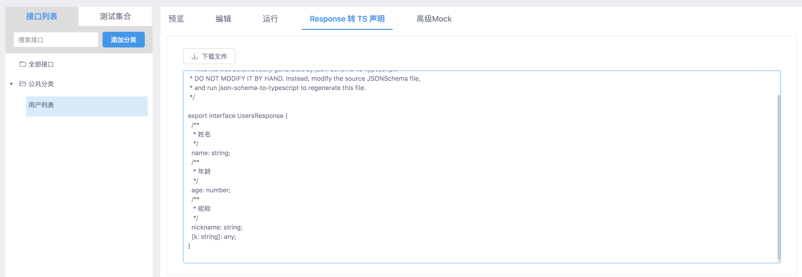
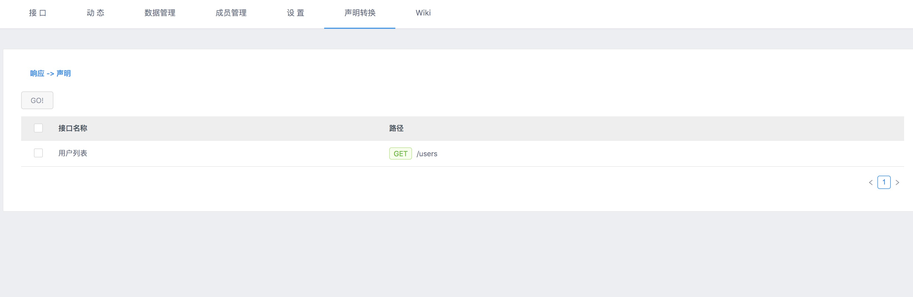

# yapi-plugin-response-to-ts

[YAPI](https://github.com/ymfe/yapi)响应转 TS 接口申明.

## 安装

 1. `yarn add https://github.com/kyuuseiryuu/yapi-plugin-response-to-ts`
 2. `ykit pack -m`
 3. `yarn start`
 
## 配置

### config.json

```json
{
  "plugins": [{
    "name": "response-to-ts"
  }]
}
```

## 使用
 
### 单接口导出  
 
 
 
---

### 批量导出  
 
 
 
